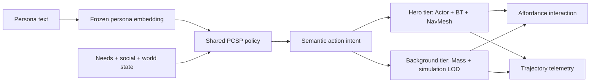
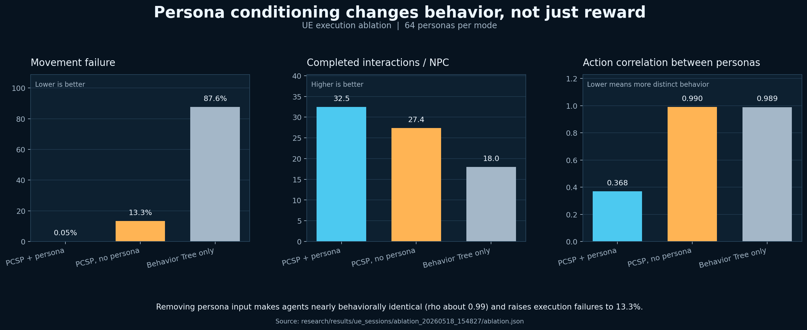
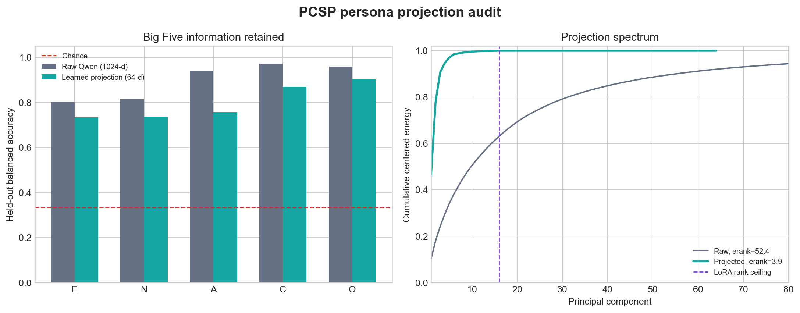
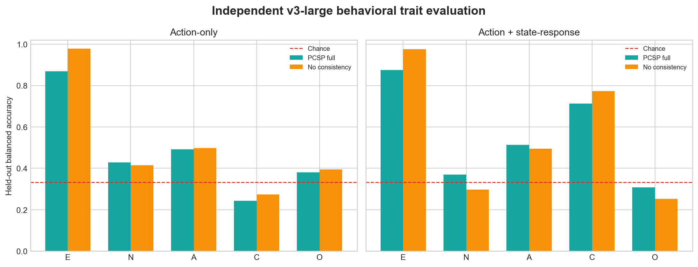
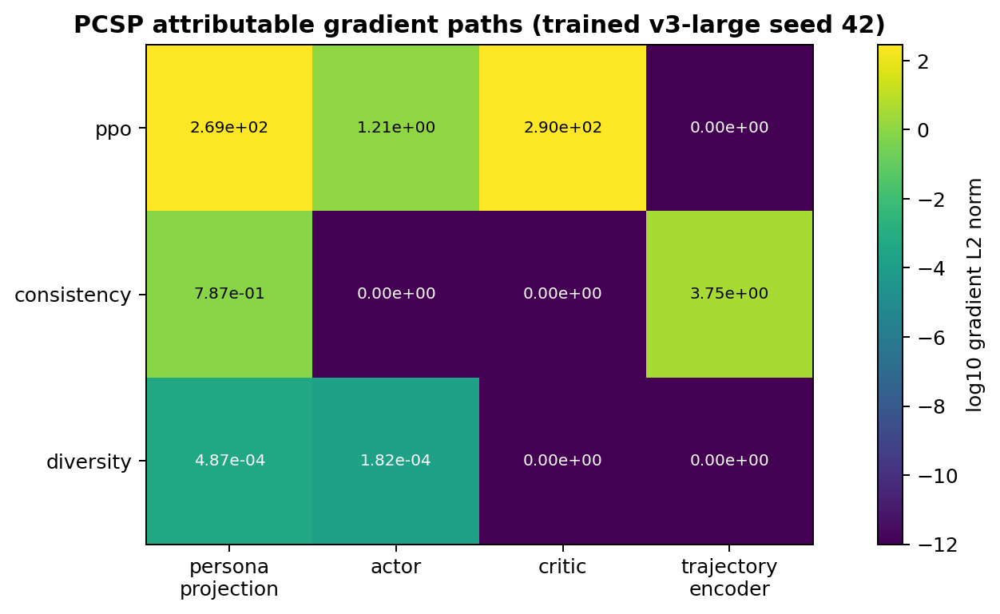
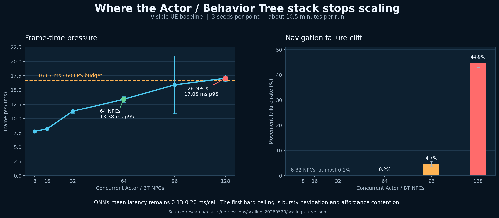
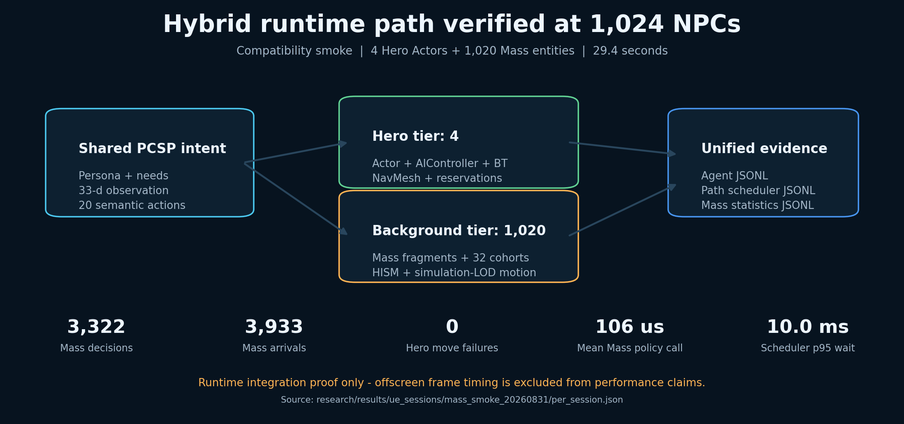
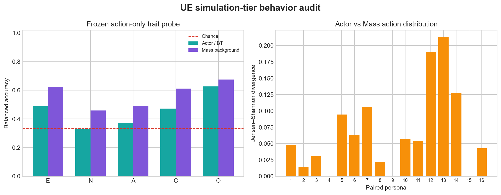

# PCSP — Persona-Conditioned Shared Policies for Scalable NPCs

PCSP gives many life-simulation NPCs distinct, designer-authored personalities
without maintaining one policy or Behavior Tree per character. A natural-language
persona is encoded once, then a single shared reinforcement-learning policy uses
that embedding to choose high-level actions for every NPC.

This repository covers the complete path from a reproducible research benchmark
to a real-time Unreal Engine deployment. The UE5 implementation combines a
high-fidelity Actor/Behavior Tree tier with a data-oriented Mass background tier,
allowing the system to preserve persona-conditioned intent while scaling toward
1,024 simultaneously simulated NPCs.

## Why this project matters

Traditional authored NPC stacks scale content cost with character count. A purely
learned controller, on the other hand, often loses debuggability and reliable
execution. PCSP separates the two concerns:



- The policy owns **what** the NPC wants to do.
- Unreal's Behavior Tree and affordance systems own **how** the action executes.
- Mass Entity represents background populations without 1,024 Characters,
  Controllers, Behavior Trees, and independent NavMesh requests.
- JSONL telemetry connects runtime behavior back to research metrics.

## Evidence at a glance

| Layer | Result | Interpretation |
| --- | --- | --- |
| Internal alignment benchmark | InfoNCE removal preserves reward while collapsing learned trajectory-to-persona retrieval toward chance | Persona consistency is load-bearing for the learned representation alignment objective |
| PCSP evaluation | Up to 11× zero-shot identification, persona/action correlation around ρ=0.73, and about 22× faster training than separate per-persona policies | One shared policy retains measurable persona structure |
| Projection audit | Big Five probe: raw 0.898 vs projected 0.799 balanced accuracy; projected effective rank 3.87 | The learned rank-16 bottleneck retains trait signal but strongly compresses general embedding geometry |
| Independent behavior probe | Action-only Big Five: full 0.482 vs no-consistency 0.511; action+state: 0.556 vs 0.558 | The independent probe does not support an InfoNCE behavioral advantage; the internal alignment claim must remain separate |
| Gradient-path audit | PPO → projection/actor/critic; InfoNCE → projection/trajectory encoder; diversity → projection/actor | InfoNCE has no direct actor-head path, and weighted diversity gradients are much smaller in the measured checkpoint probe |
| UE tier behavior audit | 16 paired personas: Actor/Mass action JS 0.066 and frozen-trait prediction agreement 71.25% | Sampled Mass telemetry preserves substantial action-level structure in one no-consistency run; multi-seed full-policy confirmation remains |
| UE Actor baseline | 64 agents: frame p95 13.38 ms, movement failure 0.2%; 128 agents: failure 44.9% | The first hard ceiling is bursty navigation, not ONNX latency |
| Visible Mass-hybrid sweep | 128–1,024 NPCs × 3 seeds × 300 s; at 1,024: frame p95 30.15 ms, 0% hero failure, 14.10 intents/NPC/min | Incremental population cost stays nearly flat, although this configuration is not a 60-FPS result |

The visible sweep completed all 12 runs without watchdog termination. Frame p95
changed from 29.90 ms at 128 NPCs to 30.15 ms at 1,024 NPCs, but the absolute
frame time remains above the 16.67-ms 60-FPS budget.

## Visual evidence















The figures are generated directly from checked-in experiment JSON. Their data
sources, caveats, and reproduction command are documented in the
[visual evidence case study](ue/cnzoi/docs/portfolio/visual-evidence.md).
The representation-level probe and its limitations are documented in the
[persona projection audit](research/docs/persona_projection_audit.md).
The deliberately model-independent countercheck is documented in the
[independent behavioral evaluation](research/docs/independent_behavior_evaluation.md).
Loss-to-module wiring is verified in the
[gradient-path audit](research/docs/gradient_path_audit.md).
The runtime bridge and its single-run limitations are in the
[UE simulation-tier behavior audit](research/docs/ue_simulation_tier_behavior.md).

## 1,024-NPC scaling design

The original Actor/BT implementation exposed a useful failure case: hundreds of
NPCs issuing `MoveTo` in the same frame overflow the practical navigation-query
budget and concentrate agents onto identical routes and affordances.

The current UE implementation adds:

- an urgency-plus-wait-age scheduler that releases a bounded number of Actor-tier
  path requests each frame;
- reservation ordering that prevents queued agents from holding scarce
  interaction capacity;
- a Mass archetype containing persona, eight needs, semantic intent, cohort,
  move target, and transform fragments;
- 32 staggered decision cohorts with a configurable per-frame inference budget;
- HISM-based low-frequency representation for background entities; and
- separate path-scheduler and Mass telemetry consumed by the scaling analyzer.

The next production-grade movement step is ZoneGraph/MassCrowd navigation with
shared hierarchical route caching and density-aware admission. See
[the 1,024-NPC engineering note](ue/cnzoi/docs/portfolio/mass-1024-scaling.md)
for the failure analysis, implementation, runbook, and acceptance criteria.

## Repository layout

- [`research/`](research/) — environments, PCSP models, training, evaluation,
  persona data, paper source, and generated experiment artifacts.
- [`ue/cnzoi/`](ue/cnzoi/) — UE 5.8 project, C++ runtime, authored affordances,
  Behavior Trees, Mass integration, demo map, HUD assets, and telemetry tools.
- [`research/paper/cog2026_main/`](research/paper/cog2026_main/) — active COG
  2026 Main Track manuscript source.
- [`ue/cnzoi/docs/portfolio/`](ue/cnzoi/docs/portfolio/) — engineering case
  studies, diagrams, observability notes, and capture guidance.

## Quick start: research

Use the `paper` Conda environment and run commands from `research/`:

```powershell
cd research
conda run -n paper python scripts/test_env.py
conda run -n paper python scripts/test_env_v3.py
```

The active execution contract is a 33-dimensional observation, a cached
64-dimensional persona embedding, and 20 semantic actions.

## Quick start: Unreal Engine

Requirements:

- a complete Unreal Engine 5.8 source/toolchain installation;
- Visual Studio 2022 with the C++ game-development workload; and
- the ONNX model and persona cache under `Content/PCSP/`.

Open [`ue/cnzoi/cnzoi.uproject`](ue/cnzoi/cnzoi.uproject), build the `cnzoiEditor`
target, then run `Map_PCSPDistrict_M` or the portfolio map in PIE. Detailed setup,
CVars, telemetry, and troubleshooting are in the
[`ue/` README](ue/README.md).

Run a repeatable hybrid scaling sweep:

```powershell
cd ue/cnzoi
./tools/run_scaling_sweep.ps1 `
  -MassHybrid `
  -TotalNpcCounts 128,256,512,1024 `
  -HeroAgentCount 16 `
  -Seeds 0,1,2 `
  -DurationSeconds 300
```

Aggregate the sessions from the repository root:

```powershell
conda run -n paper python research/scripts/analyze_scaling_sweep.py `
  --sessions ue/cnzoi/Saved/PCSP/Logs/<session-1> ue/cnzoi/Saved/PCSP/Logs/<session-2> `
  --out research/results/ue_sessions/mass_scaling_<date> `
  --plot
```

## Current portfolio status

Complete: research-to-UE contract, ONNX policy integration, hybrid
policy/Behavior Tree execution, affordance reservations, rich trajectory logs,
ablation tooling, demo HUD/camera scaffolding, Actor scaling baseline, bounded
path scheduling, Mass background simulation, 1,024-entity runtime smoke test,
visible three-seed 128–1,024 benchmark, portfolio documentation, and a
reproducible static visual evidence pack.

Still required for the final presentation: Unreal Insights profiler captures,
screenshots, and the demo video. Persona preservation by simulation tier is the
next independent-evaluation task. The video capture is intentionally left to
the project author.

## License

Source code and scripts are available under the [MIT License](LICENSE). Trained
weights, Unreal Engine content, third-party assets, and datasets may carry their
own terms.
