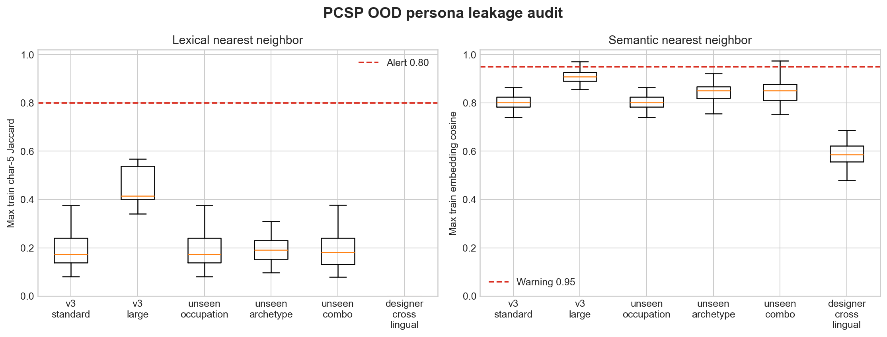

# OOD Persona Leakage Audit

## Outcome

Six active persona evaluations were audited against their training sets:
standard v3, v3-large, three compositional v3 splits, and the cross-lingual
designer set.

There is no hard identity or lexical leakage under the predeclared rules:

- persona-ID overlap: 0 in every split;
- normalized exact-text matches: 0;
- maximum character-5 Jaccard at or above 0.80: 0;
- maximum word-bigram Jaccard at or above 0.80: 0.

The overall result is nevertheless **warning**, not pass. There are eight
split-level Qwen nearest-neighbor alerts at cosine >=0.95, corresponding to
seven unique train/test pairs because standard v3 and unseen-occupation share
the same split. Manual inspection shows two strong Korean paraphrase pairs and
five v3-large records that share the generated age/occupation/trait template.



## Split summary

| Split | Gate | Exact / high lexical | Cosine >=0.95 | Max cosine |
| --- | --- | ---: | ---: | ---: |
| v3 standard | Warning | 0 | 1 | 0.973 |
| v3 large | Warning | 0 | 5 | 0.971 |
| unseen occupation v3 | Warning | 0 | 1 | 0.973 |
| unseen archetype v3 | Pass | 0 | 0 | 0.922 |
| unseen combo v3 | Warning | 0 | 1 | 0.975 |
| designer cross-lingual | Pass | 0 | 0 | 0.686 |

The v3-large set is visibly more templated: median nearest-train character-5
Jaccard is `0.415` and median embedding cosine is `0.909`. These are below the
hard lexical alert but materially closer than standard v3. The English designer
set is the cleanest lexical and semantic stress test: zero shared Korean
n-grams and maximum raw-embedding cosine `0.686`.

## Metadata split checks

The intended compositional boundaries are intact:

- standard/unseen-occupation test occupations seen in train: 0%;
- unseen-archetype Big Five combinations seen in train: 0%;
- unseen-combo occupation x Big Five cells seen in train: 0%;
- v3-large train/test Big Five combinations and occupation x combination cells
  seen in train: 0%; and
- designer occupation x Big Five cells seen in train: 0%.

Preferred-action tuples frequently recur because the environment has a small
fixed action ontology; this is reported as metadata overlap, not treated as text
leakage.

## Interpretation and follow-up

Current OOD claims are not explained by exact copies or high lexical overlap.
The preregistered follow-up now excludes those test IDs from the existing
per-persona accuracy means without tuning the threshold. Full-policy changes
range from `-0.49` to `+0.49` percentage points across the four affected split
families, and the largest absolute change across all 24 mode/run evaluations is
`2.19 pp`. See [the sensitivity report](ood_near_neighbor_sensitivity.md).

## Reproduction

From `research/`:

```powershell
conda run -n paper python scripts/test_ood_leakage.py
conda run -n paper python scripts/audit_ood_leakage.py
conda run -n paper python scripts/run_ood_near_neighbor_sensitivity.py
```

The full 390-row nearest-neighbor table and summary are under
`results/ood_leakage_audit/`.
