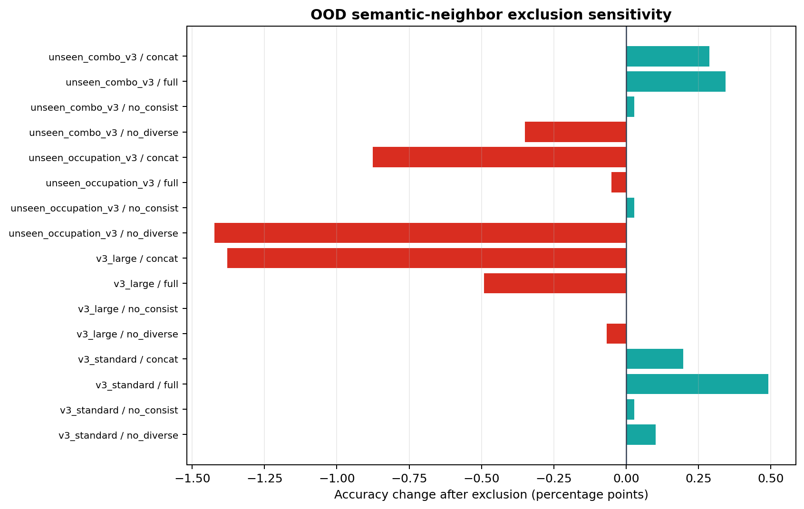

# OOD Semantic Near-Neighbor Exclusion Sensitivity

## Outcome

The seven unique train/test pairs flagged by the preregistered Qwen cosine
threshold (`>=0.95`) do not drive the persona-identification results. Excluding
the flagged **test** personas from the existing per-persona accuracy mean
changes every evaluated run by at most `2.19` percentage points.

For the full PCSP policy, the accuracy changes are:

| Split | Original | Filtered | Change |
| --- | ---: | ---: | ---: |
| v3 standard | 29.00% | 29.49% | +0.49 pp |
| unseen occupation v3 | 17.00% | 16.95% | -0.05 pp |
| unseen combo v3 | 20.33% | 20.68% | +0.34 pp |
| v3-large (3-seed mean) | 4.00% | 3.51% | -0.49 pp |



Across all 24 available mode/run evaluations, the largest absolute shift is
`2.19 pp` (`v3_large`, concat, seed 42). The full/no-consistency contrast also
survives: v3-large full changes from `4.00%` to `3.51%`, while no-consistency
remains `1.33%` on average after filtering.

## Protocol boundary

- The `0.95` threshold is read as a fixed protocol decision from the prior
  leakage audit; it was not tuned after observing these changes.
- Eight split-level alerts map to seven unique train/test pairs because persona
  295 appears in both standard-v3 and unseen-occupation evaluations.
- The analysis removes flagged test-persona scores only from the final metric
  denominator. It does not retrain a policy, remove training personas, rerun
  rollouts, or change the persona candidate set.
- Consequently, this is a dependence/sensitivity check for the reported
  identification accuracy. It does not recompute trajectory coherence or claim
  that semantically similar training examples have no effect on learning.

## Reproduction

From `research/`:

```powershell
conda run -n paper python scripts/test_ood_near_neighbor_sensitivity.py
conda run -n paper python scripts/run_ood_near_neighbor_sensitivity.py
```

Machine-readable outputs are under `results/ood_leakage_sensitivity/`.
