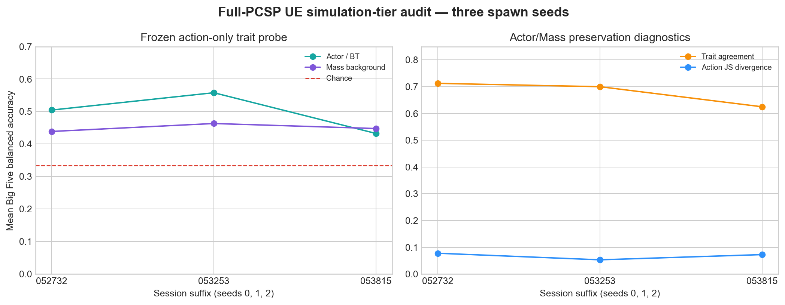

# UE Actor/Mass Simulation-Tier Behavior Audit

## Outcome

The frozen action-only evaluator now runs directly on canonical UE telemetry.
The primary confirmation consists of three 300-second visible UE 5.8
standalone runs (spawn seeds 0, 1, 2), each with the full PCSP export, 16
Actor/Behavior Tree agents, 112 Mass agents, and the same 16 sampled persona
IDs.

Across spawn seeds, the frozen probe's mean balanced accuracy is
`0.498 +/- 0.063` for Actor trajectories and `0.450 +/- 0.012` for Mass
trajectories. Actor/Mass action distributions have mean Jensen--Shannon
divergence `0.068 +/- 0.013`, and their five-axis trait predictions agree
`67.9% +/- 4.7%` of the time (mean +/- sample standard deviation). The
Mass-minus-Actor balanced-accuracy difference is `-0.048 +/- 0.057` and changes
sign across seeds, so these data do not support tier superiority.



The result confirms that moving background agents into Mass does not
automatically erase the policy's action-level persona signal. It does **not**
establish absolute persona fidelity in UE: the evaluator was fitted in
Mini-Inzoi, Actor and Mass use different execution loops, and their decision
counts are not cadence-matched. The earlier seed-7 `no_consist` bridge run
(Actor BA `0.458`, Mass BA `0.571`, JS `0.066`) remains a telemetry-contract
check rather than an ablation comparison because it has only one spawn seed.

## Telemetry contract

- Actor decision rows now emit `policy_action_index`, the 0--19 index before
  Unreal maps movement outputs to semantic execution actions.
- Mass logs the lowest 16 stable-index entities by default to
  `mass_trajectories.jsonl`; `pcsp.MassTrajectorySampleCount 0` disables it.
- Each Mass row contains time, stable index, persona ID, canonical policy action
  index, executed action name, position, and eight needs.
- The Mass logger batches sampled rows into the existing one-second telemetry
  flush, avoiding a file write for every decision.
- `scripts/evaluate_ue_behavior_tiers.py` consumes only chosen action indices
  for the primary frozen probe. Logged logits are retained for other analysis
  but are not evaluator features.

## Validation evidence

- `cnzoiEditor Win64 Development` compiled successfully on UE 5.8.
- Full-PCSP sessions `20260901_052732`, `20260901_053253`, and
  `20260901_053815` all exited with code 0 after 320--323 seconds.
- Each produced 16 Actor files, 300 frame samples, and 676--685 sampled Mass
  decisions covering all 16 paired personas.
- The checked-in result directory includes a compact canonical copy of the
  source decisions, predictions, metrics, and PNG/SVG figure so the audit does
  not depend on ignored Unreal `Saved/` files.
- `scripts/aggregate_ue_behavior_tiers.py` validates that input runs share one
  ablation/policy protocol and emits per-seed CSV plus descriptive aggregates.

## Reproduction

From `research/`:

```powershell
conda run -n paper python scripts/evaluate_ue_behavior_tiers.py `
  --session ../ue/cnzoi/Saved/PCSP/Logs/<session> `
  --output results/ue_sessions/tier_behavior_<session>

conda run -n paper python scripts/aggregate_ue_behavior_tiers.py `
  --inputs results/ue_sessions/tier_behavior_full_*/ue_behavior_eval.json `
  --output results/ue_sessions/tier_behavior_full_multiseed_20260901
```
