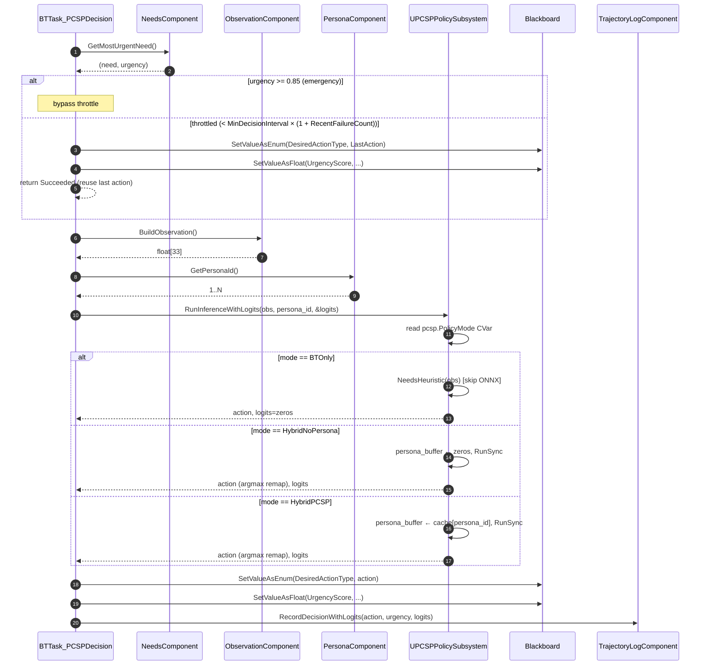
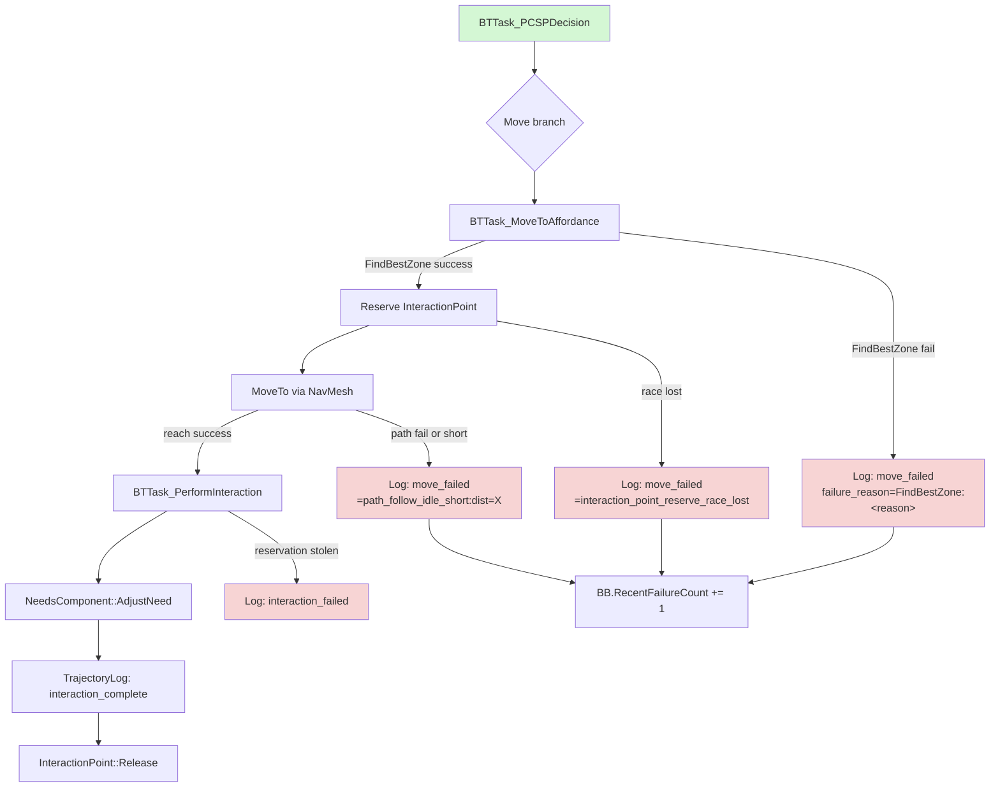
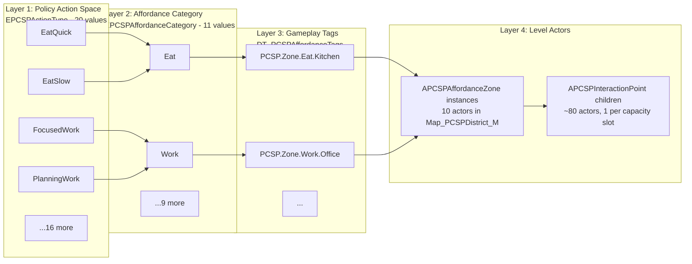
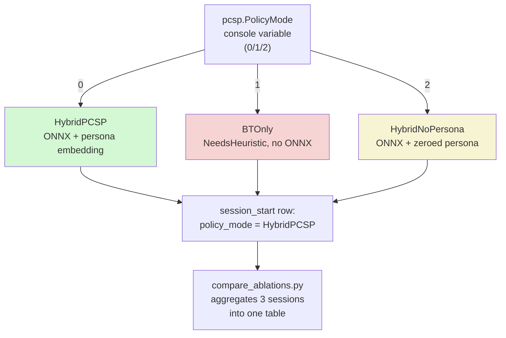

# Phase 5 — Architecture & Data-Flow Diagrams

Mermaid source for the architectural figures referenced by the paper extension.
Render with any Mermaid-aware viewer (GitHub renders these inline).

---

## 1. System overview — research ↔ UE5 split

```mermaid
flowchart LR
    subgraph Research["research/ (Python)"]
        Per[personas_300_v3.json] --> Emb[Qwen3 embeddings]
        Emb --> Train[PCSP PPO trainer]
        Env[MiniInzoiV3Env] --> Train
        Train --> Ckpt[policy.pt]
        Ckpt --> Export[export_pcsp_onnx.py]
        Emb --> Export
        Export --> Onnx[pcsp_actor.onnx]
        Export --> EmbJson[persona_embeddings.json]
    end

    subgraph UE5["ue/cnzoi/ (Unreal Engine 5)"]
        Onnx --> Subsys[UPCSPPolicySubsystem]
        EmbJson --> Cache[UPCSPPersonaCache]
        Cache --> Subsys
        Subsys --> BT[BT_PCSPAgent + BB_PCSPAgent]
        BT --> Agent[APCSPAgentCharacter]
        Agent --> Log[UPCSPTrajectoryLogComponent]
        Log --> Jsonl[agent_p*.jsonl]
    end

    subgraph Analysis["research/scripts/"]
        Jsonl --> Analyze[analyze_ue_session.py]
        Analyze --> Cmp[compare_ablations.py]
        Cmp --> Tables[results/ue_sessions/*.json]
    end

    style Research fill:#eef
    style UE5 fill:#efe
    style Analysis fill:#fee
```



---

## 2. Per-decision data flow (single agent, one BT tick)



---

## 3. BT subtree after decision



---

## 4. Three-layer affordance system



---

## 5. Phase 4 ablation runtime switch



The ablation result colors above match the 2026-05-18 outcome: HybridPCSP =
0% fail / 708 reward (green), BTOnly = 87.6% fail / 395 reward (red),
HybridNoPersona = 13.3% fail / 574 reward (yellow).

---

## Render notes

- All five diagrams render directly in GitHub's Markdown preview.
- For paper inclusion, export each to PDF/PNG via [mermaid-cli](https://github.com/mermaid-js/mermaid-cli):
  ```
  mmdc -i diagrams.md -o ../../../paper/figures/fig_<name>.pdf
  ```
- Diagrams 1, 2, and 3 are the most paper-load-bearing; 4 is reference for
  the architecture writeup; 5 documents the ablation methodology.
