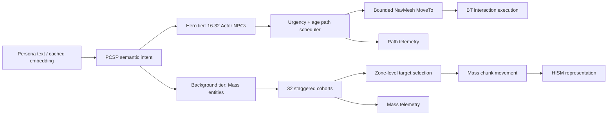

# PCSP 1024-NPC Mass Scaling

## Portfolio Claim

The useful engineering story is not "1024 Characters were spawned." It is:

1. measure where the Actor/Behavior Tree implementation stops scaling;
2. preserve the full-fidelity stack for nearby hero NPCs;
3. move background NPC state into Mass chunks;
4. prevent synchronous navigation and policy bursts; and
5. prove that persona-conditioned semantic behavior survives the transition.

The existing Actor baseline supplies the failure case. At 64 agents it held
frame p95 below 14 ms and movement failure below 0.2%. At 96 agents movement
failure rose to 4.7%; at 128 it reached 44.9%. ONNX inference stayed near
0.13--0.20 ms per call. The hard ceiling was the burst of individual Recast
path requests, not the shared PCSP actor network.

## Why 1024 Simultaneous Paths Fail

Submitting 1024 independent `MoveTo` requests in one frame creates several
coupled problems:

- Recast's async query queue receives a burst much larger than the normal
  gameplay budget.
- many agents choose the same shortest route and interaction capacity at the
  same time, producing reservation races and crowd congestion;
- 1024 `ACharacter`, `AAIController`, Blackboard, Behavior Tree, collision,
  movement, and skeletal-animation instances carry high object and tick cost;
- simultaneous PCSP decisions create latency spikes even when average ONNX
  inference is inexpensive;
- per-agent JSONL logging and per-agent visualization can become new I/O and
  render-thread bottlenecks after navigation is fixed.

Increasing Recast queue limits alone only moves the bottleneck and increases
memory pressure. The solution is load shaping plus simulation LOD.

## Implemented Architecture



### Actor-tier path scheduling

`UPCSPPathRequestSchedulerSubsystem` limits released `MoveTo` calls per frame
(`pcsp.PathRequestsPerFrame`, default 8). Requests are ranked by urgency plus
wait age, preventing starvation. A BT task waits before reserving an
interaction point, so queued agents do not hold scarce capacity.

Telemetry is written to `path_scheduler.jsonl`:

- queue and peak depth;
- enqueued, granted, submitted, and cancelled counts;
- mean and p95 permit wait; and
- active request budget.

Set `pcsp.PathSchedulingEnabled 0` to reproduce the unscheduled baseline.

### Mass background tier

`APCSPMassSpawner` creates a contiguous archetype containing:

- persona identity and cohort;
- eight needs;
- current PCSP action/category;
- zone-level move target; and
- `FTransformFragment`.

`UPCSPMassSimulationProcessor` updates the archetype chunk-by-chunk. Decisions
are staggered over 32 cohorts and capped by
`pcsp.MassMaxDecisionsPerFrame` (default 32). The Mass tier uses the same
33-dimensional observation contract and the same ONNX semantic policy when it
is available.

Background movement deliberately does not issue a NavMesh query per entity.
It selects an authored affordance-zone target and uses a cheap zone-level
movement approximation. A low-frequency HISM represents the population. The
existing Actor/BT/NavMesh path remains the high-fidelity execution tier.

This first implementation is an explicit simulation LOD boundary, not a claim
that straight-line background movement is production navigation.

## Run The 1024-NPC Configuration

The recommended portfolio configuration retains 16 hero agents and adds 1008
Mass entities:

```powershell
cd ue/cnzoi
./tools/run_scaling_sweep.ps1 `
  -MassHybrid `
  -TotalNpcCounts 128,256,512,1024 `
  -HeroAgentCount 16 `
  -Seeds 0,1,2 `
  -DurationSeconds 300
```

For one manual run, pass:

```text
-PCSP_AgentCount=16
-PCSP_MassEntityCount=1008
-PCSP_SpawnSeed=0
-PCSP_RunDurationSeconds=300
```

Aggregate both the old Actor sweep and the new Mass sweep together:

```powershell
conda run -n paper python research/scripts/analyze_scaling_sweep.py `
  --sessions ue/cnzoi/Saved/PCSP/Logs/<session-a> ue/cnzoi/Saved/PCSP/Logs/<session-b> `
  --out research/results/ue_sessions/mass_scaling_<date> `
  --plot
```

The table includes architecture, total/hero/Mass counts, frame time, Actor
failure rate, scheduler queue/wait, and Mass policy latency.

## Verified Smoke Test

Session `20260831_035336` verified the runtime path with 4 hero agents and 1020
Mass entities:

- 1024 total simulated NPCs;
- 3,322 Mass PCSP decisions in 29.4 seconds;
- 3,933 Mass zone arrivals;
- 0 Actor movement failures;
- scheduler p95 wait about 10 ms; and
- mean Mass policy call about 106 microseconds.

This was a UE 5.8 `-RenderOffscreen` compatibility smoke test. That mode also
throttled a 4-agent control run, so its frame-time numbers are deliberately not
used as performance evidence. Capture final performance in normal PIE or a
visible standalone build on the target UE 5.7 installation.

## Next Optimization Stages

The following stages provide the strongest further portfolio value.

### 1. ZoneGraph and MassCrowd

Replace straight-line background movement with lane-based ZoneGraph paths and
MassCrowd density/avoidance. Compute one coarse route per origin/destination
zone pair and let many entities follow it. This changes pathfinding complexity
from one global Recast query per NPC to cached zone routes plus local steering.

### 2. Shared hierarchical path cache

For hero and mid-tier agents:

- cache paths by `(origin zone, destination zone, nav generation)`;
- invalidate on NavMesh generation changes or blocked portals;
- share the coarse corridor while retaining an individual final approach;
- add randomized corridor offsets to prevent route collapse.

### 3. Density-aware admission

Track predicted arrivals as well as current occupancy. Select a zone using
distance, capacity, queue length, and route density. Apply back-pressure before
agents enter an already saturated corridor.

### 4. Representation and simulation LOD

- near: Actor, CharacterMovement, BT, skeletal mesh;
- mid: Mass navigation, simplified animation, collision only when needed;
- far: HISM/impostor and low-frequency semantic simulation;
- off-screen: zone-population counts with event sampling.

Promotion/demotion should preserve persona ID, needs, intent, target, and recent
trajectory state.

### 5. True batched NNE execution

Export a dynamic-batch ONNX model (`[B,33]`, `[B,64] -> [B,20]`) and execute
one batch per cohort. This becomes valuable after Actor and navigation costs
are removed; it was not the original 128-agent bottleneck.

### 6. Sampled observability

Keep aggregate counters for all entities but rich JSONL traces for only the
observed hero set and a reproducible background sample. This preserves
debuggability without turning disk writes into the next ceiling.

## Acceptance Criteria

A publishable result should report three seeds for Actor and Mass-hybrid runs
at 64, 128, 256, 512, and 1024 total NPCs:

- frame mean, p95, and p99;
- game-thread, navigation, Mass processor, and render-thread time;
- memory per NPC;
- path queue depth and wait;
- movement/interaction failure;
- decisions and completed intents per NPC per minute;
- PCSP batch latency; and
- persona-distinctness or identification accuracy by simulation tier.

The strongest claim is not just 60 fps. It is that simulation LOD recovers
scale while maintaining the persona-conditioned action distribution.
