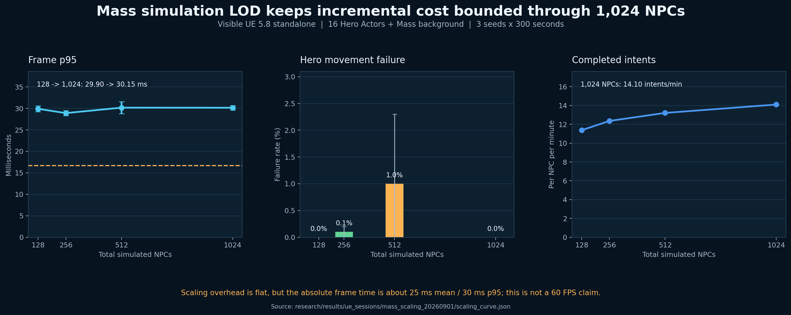

# Visible Mass-Hybrid Benchmark — 2026-09-01

## Result

The UE 5.8 Mass-hybrid stack completed all 12 planned visible standalone runs:

- total NPCs: 128, 256, 512, and 1,024;
- 16 full Actor/AIController/Behavior Tree hero NPCs in every run;
- 112, 240, 496, or 1,008 Mass background entities;
- seeds 0, 1, and 2;
- 300 seconds of measurement per run; and
- exit code 0 for every run, without watchdog termination.

Each session contains 16 per-agent trajectory logs plus frame, path-scheduler,
Mass, zone-occupancy, and run-configuration telemetry. Eleven sessions contain
300 frame samples and the first contains 299; every session contains 296 Mass
samples.

## Aggregate Evidence

| Total NPCs | Frame mean (ms) | Frame p95 (ms) | Hero move failure | Completed intents/NPC/min | Mass policy mean (us) |
| ---: | ---: | ---: | ---: | ---: | ---: |
| 128 | 24.81 ± 0.29 | 29.90 ± 0.67 | 0.0% | 11.38 ± 0.04 | 203.2 ± 5.4 |
| 256 | 24.42 ± 0.27 | 28.91 ± 0.59 | 0.1% | 12.36 ± 0.04 | 171.4 ± 2.4 |
| 512 | 24.76 ± 0.30 | 30.17 ± 1.42 | 1.0% | 13.21 ± 0.02 | 133.5 ± 0.6 |
| 1,024 | 25.47 ± 0.47 | 30.15 ± 0.53 | 0.0% | 14.10 ± 0.01 | 101.0 ± 2.0 |

Values are mean ± population standard deviation over three seeds. Hero failure
is elevated at 512 only because seed 0 recorded 14
`path_follow_idle_short` events; seed 1 recorded none and seed 2 recorded one.
All three 1,024-NPC runs recorded zero hero movement failures.



## Interpretation Boundary

The important result is bounded incremental cost, not 60 FPS. Increasing the
population from 128 to 1,024 changes frame p95 from 29.90 to 30.15 ms and frame
mean from 24.81 to 25.47 ms while keeping the full hero stack fixed at 16.
The viewport therefore runs at roughly 39–41 FPS in this configuration and
does not satisfy a 16.67 ms 60-FPS target.

The Mass tier uses authored zone targets, chunk processing, staggered decision
cohorts, and HISM representation. It does not provide per-entity NavMesh paths
or production crowd avoidance. The benchmark establishes that this explicit
simulation-LOD boundary keeps additional population cost nearly flat through
1,024 simulated NPCs while preserving useful intent throughput.

Persona preservation by simulation tier is intentionally not claimed here. It
requires the independent behavioral evaluator described in the follow-up
portfolio validation work.

## Reproduction

```powershell
cd ue/cnzoi
./tools/run_scaling_sweep.ps1 `
  -MassHybrid `
  -TotalNpcCounts 128,256,512,1024 `
  -HeroAgentCount 16 `
  -Seeds 0,1,2 `
  -DurationSeconds 300
```

Aggregate from the repository root:

```powershell
conda run -n paper python research/scripts/analyze_scaling_sweep.py `
  --sessions <the twelve Saved/PCSP/Logs session directories> `
  --out research/results/ue_sessions/mass_scaling_20260901 `
  --plot
```

Checked-in evidence:

- `research/results/ue_sessions/mass_scaling_20260901/per_session.json`
- `research/results/ue_sessions/mass_scaling_20260901/scaling_curve.json`
- `research/results/ue_sessions/mass_scaling_20260901/latency_budget.tsv`
- `research/results/ue_sessions/mass_scaling_20260901/scaling_curve.png`

Raw runtime telemetry remains under ignored `ue/cnzoi/Saved/PCSP/Logs/` session
directories because it is generated engine output.
